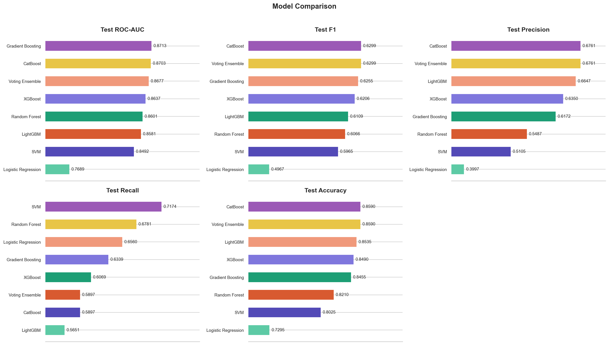
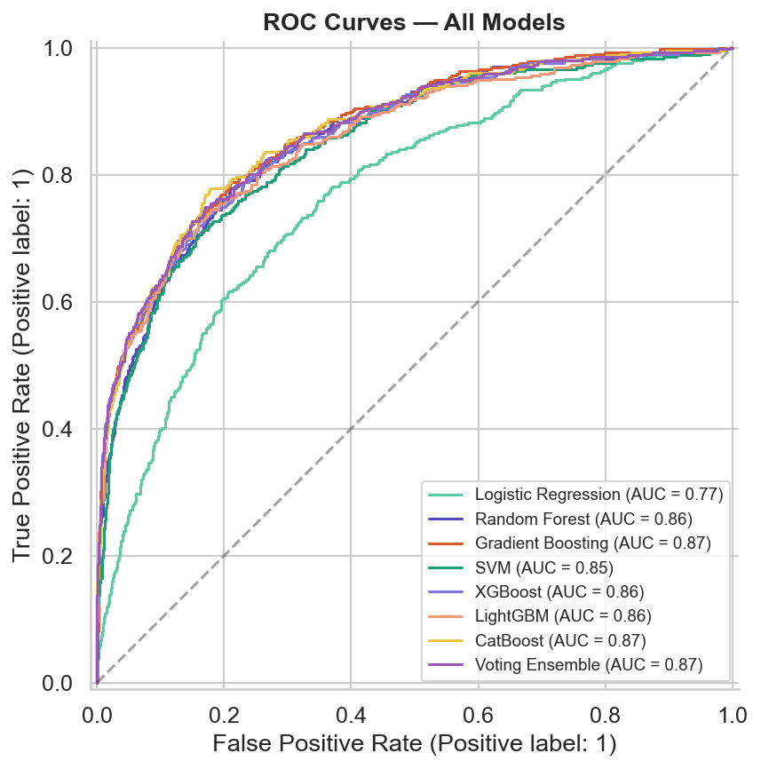
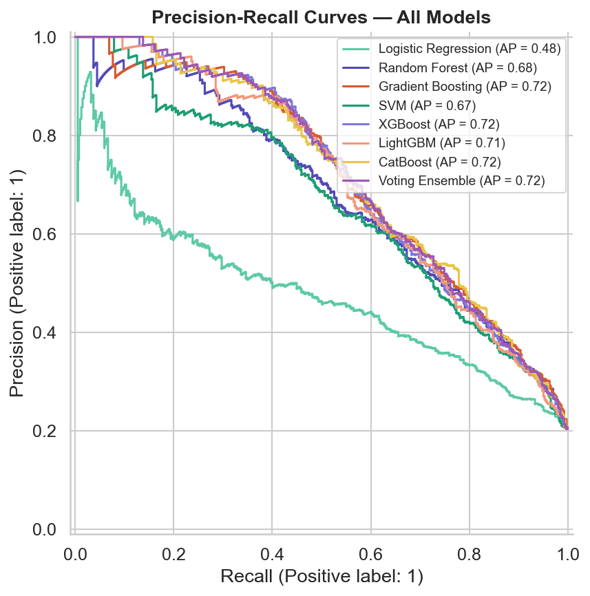
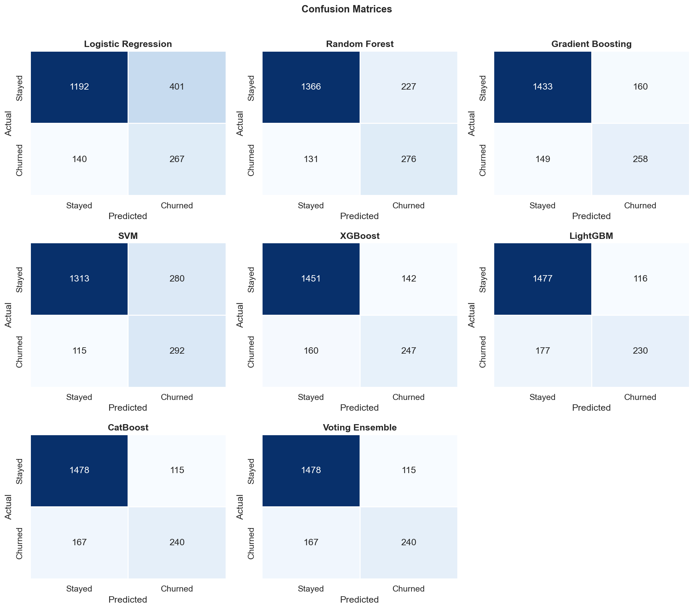
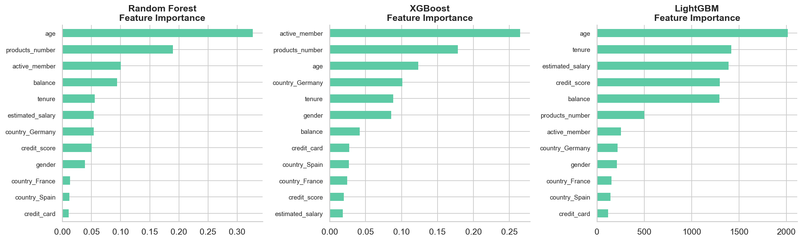

# Customer Churn Prediction & Analysis System

A comprehensive, end-to-end machine learning web application meticulously designed to predict whether a bank customer is likely to stay or churn. This project encapsulates the complete data science lifecycle—from initial exploratory data analysis (EDA) and rigorous feature engineering to the deployment of robust predictive models via a high-performance FastAPI backend, wrapped in an elegant and responsive web frontend.<br>
Deployment : https://churnsight.onrender.com

---

## Table of Contents
1. [Executive Summary](#executive-summary)
2. [Business Use Case](#business-use-case)
3. [Key Features](#key-features)
4. [Dataset Overview](#dataset-overview)
5. [Machine Learning Pipeline](#machine-learning-pipeline)
6. [System Architecture & Directory Structure](#system-architecture--directory-structure)
7. [Installation and Setup](#installation-and-setup)
9. [Model Evaluation and Visualizations](#model-evaluation-and-visualizations)
10. [Technologies Used](#technologies-used)
11. [Future Roadmap](#future-roadmap)
12. [License](#license)

---

## Executive Summary
Customer retention is one of the most critical KPIs for financial institutions. Acquiring a new customer is widely recognized to be significantly more expensive than retaining an existing one. This system leverages rich historical data—encompassing customer demographics, account behavior, and financial standing—to preemptively identify customers at a high risk of churning. By equipping stakeholders with real-time predictive insights, banks can launch targeted retention campaigns, personalize customer interventions, and dramatically improve overall profitability.

## Business Use Case
In the modern banking sector, churn prediction models act as an essential risk mitigation tool. 
- **Proactive Retention:** Identify dissatisfied or at-risk customers before they close their accounts.
- **Resource Allocation:** Direct marketing budgets and retention offers exclusively toward the highest-risk cohorts.
- **Customer Insights:** Uncover the hidden drivers of churn (such as low activity, product dissatisfaction, or age demographics) through feature importance analysis.

## Key Features
- **Exploratory Data Analysis (EDA):** Deep-dive statistical insights into the underlying dataset, illuminating feature distributions, correlations, and target variable imbalances.
- **Advanced Predictive Modeling:** Extensive evaluation and hyperparameter tuning across multiple state-of-the-art classification algorithms, including Logistic Regression, Random Forest, Support Vector Machines (SVM), XGBoost, LightGBM, CatBoost, and customized Voting Ensembles.
- **RESTful API Backend:** A scalable, asynchronous API built with FastAPI that processes incoming customer profiles and returns real-time churn probabilities and risk classifications.
- **Interactive Web Interface:** A modern, intuitively designed user interface that communicates seamlessly with the API, providing visual feedback and risk assessments instantaneously.
- **Comprehensive Evaluation Suite:** Automated generation of vital model assessment metrics, visually represented through Receiver Operating Characteristic (ROC) curves, Precision-Recall curves, confusion matrices, and feature importance bar charts.

## Dataset Overview
The model is trained on a robust bank customer dataset. Key features analyzed by the machine learning models include:
- `CreditScore`: The individual's credit score.
- `Geography`: The country of residence (e.g., France, Spain, Germany).
- `Gender`: The customer's gender.
- `Age`: The customer's age.
- `Tenure`: Number of years the customer has been with the bank.
- `Balance`: The account balance.
- `NumOfProducts`: The number of bank products the customer utilizes.
- `HasCrCard`: Binary indicator of whether the customer possesses a credit card.
- `IsActiveMember`: Binary indicator of the customer's active status.
- `EstimatedSalary`: The customer's estimated annual salary.
- `Exited` **(Target Variable)**: Binary indicator denoting if the customer churned (1) or stayed (0).
Link : https://www.kaggle.com/datasets/radheshyamkollipara/bank-customer-churn

## Machine Learning Pipeline
Our robust data pipeline consists of several meticulously engineered stages:
1. **Data Cleaning & Preprocessing:** Handling missing values, removing duplicates, and structuring data limits.
2. **Feature Engineering & Encoding:** Transforming categorical variables (like `Geography` and `Gender`) using One-Hot Encoding and Label Encoding.
3. **Feature Scaling:** Standardizing numerical features using `StandardScaler` to ensure algorithms like SVM and Logistic Regression perform optimally.
4. **Handling Imbalance:** Utilizing techniques like SMOTE (Synthetic Minority Over-sampling Technique) or class weight adjustments to treat the natural skew towards retained customers.
5. **Model Training & Cross-Validation:** Training multiple baseline and ensemble models, utilizing cross-validation to prevent overfitting.
6. **Artifact Serialization:** Exporting the highest-performing model, complete with fitted scalers and pipeline transformers, into `joblib` artifacts for seamless production deployment.

## System Architecture & Directory Structure
```text
...\Customer Churn Bank\
├── main.py                    # Core FastAPI application serving REST endpoints
├── requirements.txt           # Exhaustive list of Python dependencies
├── Backend/
│   └── model/                 # Serialized joblib artifacts (churn_model.pkl, scaler.pkl, etc.)
├── Dataset/                   # Raw CSV datasets and processed training subsets
├── frontend/                  # Web interface assets (HTML5, CSS3, Vanilla JS, images)
├── noteboook/                 # Jupyter Notebooks containing the EDA and Modeling pipelines
└── plots/                     # Auto-generated PNG visualizations from the evaluation phase
```

## Installation and Setup

### Prerequisites
- Python 3.8+ architecture
- Git version control
- Command line terminal access

### Local Deployment Steps

1. **Clone the Repository:**
   Retrieve the codebase to your local environment.
   ```bash
   git clone <repository-url>
   cd "Customer Churn Bank"
   ```

2. **Create a Virtual Environment:**
   It is highly recommended to isolate application dependencies.
   ```bash
   python -m venv venv
   # On Windows:
   venv\Scripts\activate
   # On macOS/Linux:
   source venv/bin/activate
   ```

3. **Install Dependencies:**
   Install all required libraries utilized by the pipeline and API.
   ```bash
   pip install --upgrade pip
   pip install -r requirements.txt
   ```

4. **Launch the Server:**
   Start the FastAPI application utilizing Uvicorn.
   ```bash
   uvicorn main:app --host 127.0.0.1 --port 8000 --reload
   ```

## UI Overview   

## Model Evaluation and Visualizations

### 1. Model Comparisons
This comparison balances key evaluation metrics, placing special emphasis on the F1 score, precision, and recall rather than mere structural accuracy, ensuring robustness against imbalanced classes.



### 2. ROC Curves
The Receiver Operating Characteristic (ROC) curves visually demonstrate the trade-off balance between the true positive rate (sensitivity) and false positive rate (1-specificity) across various decision thresholds.



### 3. Precision-Recall Curves
Because churn datasets are inherently imbalanced (most customers do not churn), Precision-Recall curves provide a much more accurate depiction of how well the models distinguish the positive (churned) class.



### 4. Confusion Matrices
These individual matrices delineate the exact distributions of True Positives, True Negatives, False Positives (Type I errors), and False Negatives (Type II errors) across our deployed models.



### 5. Feature Importance
This essential visualization highlights the predictive power of different client metrics. Driven primarily by our Gradient Boosting algorithms (XGBoost/LightGBM), it reveals which attributes—such as `Age`, `Balance`, or `NumOfProducts`—are the strongest indicators of imminent churn.



## Technologies Used
- **Backend Infrastructure:** FastAPI, Uvicorn, Pydantic
- **Machine Learning & Data Processing:** Scikit-Learn, Pandas, NumPy, XGBoost, LightGBM, CatBoost
- **Model Serialization:** Joblib
- **Frontend Development:** HTML5, CSS3, Vanilla JavaScript, Chart.js
- **Data Visualization (Notebooks):** Matplotlib, Seaborn

## License
This project is licensed under the MIT License. You are free to utilize, modify, and distribute this software in accordance with the license conditions.
